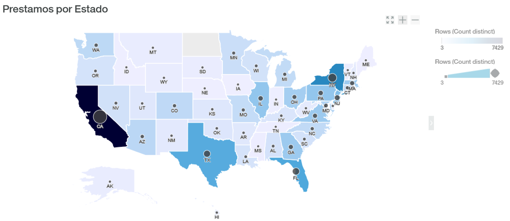

```{r include=FALSE, ECHO=FALSE, cache=FALSE}
 source("EDA.R")
library(knitr)
```

```{r include=FALSE, ECHO=FALSE, cache=FALSE}
 source("EDA2.R")
library(knitr)
```


```{r setup, include=FALSE}
knitr::opts_chunk$set(echo = TRUE)
```

## Session Information for the Reproducible Research
```{r, message=FALSE,results='hide',warning=FALSE,echo=FALSE}
sessionInfo()
```


## DAT001 Lenguajes de programacion orientados al análisis de datos

## Objetivo
Este es el proyecto final correspondiente al curso *DAT001 Lenguajes orientados al análisis de datos* el cual consiste en desarrollar un analisis que aplique los temas vistos en clase. 

El proyecto consiste en seleccionar una base de datos, analizar los datos y definir un objetivo general del proyecto, el cual consiste en solucionar un problema que se pueda resolver por medio de los datos en la base. 

**Durante el proyecto, se deben aplicar las técnicas de limpieza de datos y de vectorización que se vieron durante el curso. **

## Business Understanding

Lending Club es una plataforma donde las personas pueden pedir y dar préstamos personales para diferentes tipos de proyectos.
Lending Club les permite a los prestatarios crear préstamos personales sin garantía entre **$1,000** y **$40,000** con un período de préstamo estándar de tres años. 
Los inversores pueden buscar y navegar en las listas de préstamos en el sitio web de Lending Club y seleccionar los préstamos en los que desean invertir en función de la información suministrada sobre el prestatario, el monto del préstamo, el grado del préstamo y el propósito del préstamo. 
Los inversores hacen dinero con intereses. Lending Club gana dinero al cobrar a los prestatarios una tarifa de originación y a los inversores una tarifa de servicio.

### Problema
La gerencia de LendingClub ha solicitado un estudio estadistico con el fin de identificar areas de mejora y poder realizar un marketing mas personalizado.
El estudio se enfoca en clasificar e identificar las relaciones que existen entre las diferentes variables.


## Data Understanding
Los datos contiene *143* variables y *42538* observaciones.
El rango de los datos es del 2007 al 2011.

El diccionario de datos: 
```{r,echo=FALSE, warning=FALSE, message=FALSE}
kable(LCDataDictionary)
```


## Data Preparation
Se seleccionarion 47 columnas a utilizar en la exploracion de datos.

```{r,echo=FALSE, warning=FALSE, message=FALSE}
kable(summary(select(df_loan,1:6)))

```


## Data Mining

### Prestamos por tipo de Solicitud
El siguiente WordCloud muestra los propositos por los cuales se ha solicitado un prestamo.
En este se aprecia que **"Consolidacion de Deudas (debyConsolid)"** es el principal proposito por los cuales se solicita un prestamo, seguido por **Tarjetas de Credito** y **Mejoras para el hogar**


Este WordCloud muestra los titulos ingresados en la solicitud del prestamo por parte de los solicitantes. Se observa que **Consolidacion de deudas** y **Prestamos Personales** son los principales titulos.


### Prestamos por Longevidad Laboral
Este boxplot muestra que la mayoria de los solicitantes de prestamos tienen mas de **10 annos** de laborar, despues los de menos de **un anno o 2 annos**.

```{r echo=FALSE, warning=FALSE, message=FALSE}
prestamosbyLong
```

Aca se muestra el plazo de la solicitud de prestamos por el tipo de longevidad laboral, donde se observa la relacion entre el tipo de prestamo por tipo de empleado.

```{r echo=FALSE, warning=FALSE, message=FALSE}
percebyLong
```

### Prestamos por propiedad de vivienda
Los prestatarios que tienen una hipoteca o que rentan son los mayores solicitantes.

```{r echo=FALSE, warning=FALSE, message=FALSE}
prestamosbyHome
```

### Prestamos por Estado
Este map muestra la cantidad de prestamos que se han solicitado por el estado.
Siendo **California, Nueva York, Florida** y **Texas** los top 4.




## Conclusiones

- Para atraer mas mercado se debe enfocar en el area de **Consolidacion de Deudas**
- Se puede explotar el area de **Prestamos Personales**
- Las personas de mas de 10 annos y 1-2 annos de longevidad laboral, son los que solicitan mas prestamos.
- Los prestamos de un plazo de 36 meses son los mas cotizados.
- Personas que rentan o tienen una hipoteca suelen solicitar mas creditos que los que tienen casa propia.


